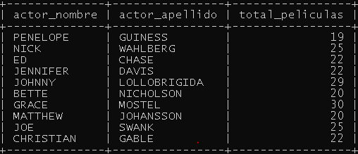
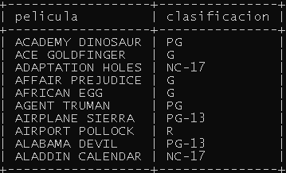
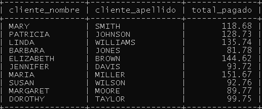
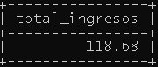
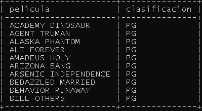

### Consultas INNER JOIN

### Obtener detalles de películas con sus idiomas
````sql
SELECT f.title AS pelicula, l.name AS idioma
FROM film f
INNER JOIN language l ON f.language_id = l.language_id
INNER JOIN language l ON f.language_id = l.language_id
LIMIT 10;
````


### Listar actores con la cantidad de películas en las que han participado
````sql
SELECT a.first_name AS actor_nombre, a.last_name AS actor_apellido, COUNT(fa.film_id) AS total_peliculas
FROM actor a
INNER JOIN film_actor fa ON a.actor_id = fa.actor_id
GROUP BY a.actor_id
LIMIT 10;
````


### Mostrar clientes con sus direcciones y ciudades
````sql
SELECT c.first_name AS cliente_nombre, c.last_name AS cliente_apellido, a.address AS direccion, ci.city AS ciudad
FROM customer c
INNER JOIN address a ON c.address_id = a.address_id
INNER JOIN city ci ON a.city_id = ci.city_id
LIMIT 10;
````


### Obtener un listado de películas y sus clasificaciones
````sql
SELECT f.title AS pelicula, f.rating AS clasificacion
FROM film f
LIMIT 10;
````


### Listar clientes con el monto de pagos realizados  
````sql
SELECT c.first_name AS cliente_nombre, c.last_name AS
cliente_apellido, SUM(p.amount) AS total_pagado
FROM customer c
INNER JOIN payment p ON c.customer_id = p.customer_id
GROUP BY c.customer_id
LIMIT 10;
````



### Procedimientos

### Listar clientes de una ciudad especifica
````sql
DELIMITER //
mysql> CREATE PROCEDURE IngresosPorCliente(IN cliente_id INT)
    BEGIN
    SELECT SUM(p.amount) AS total_ingresos
    FROM payment p
    WHERE p.customer_id = cliente_id
    LIMIT 10;
    END //
````


### Listar peliculas que tienen una calificacion especifica
````sql
BEGIN
    SELECT f.title AS pelicula, f.rating AS clasificacion
    FROM film f
    WHERE f.rating = calificacion
    LIMIT 10;
    END //
````
